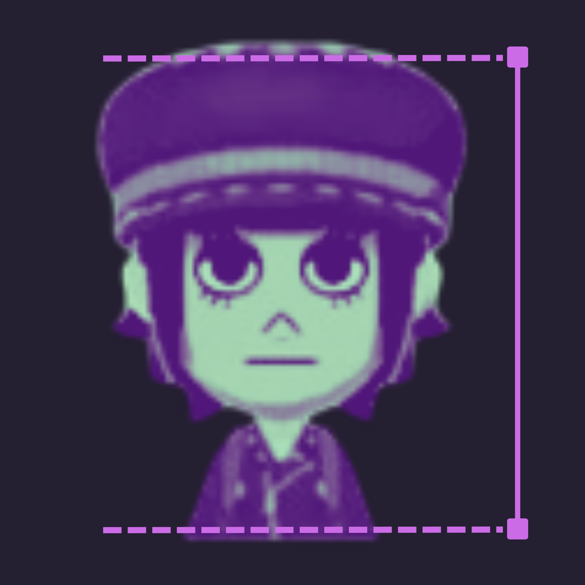
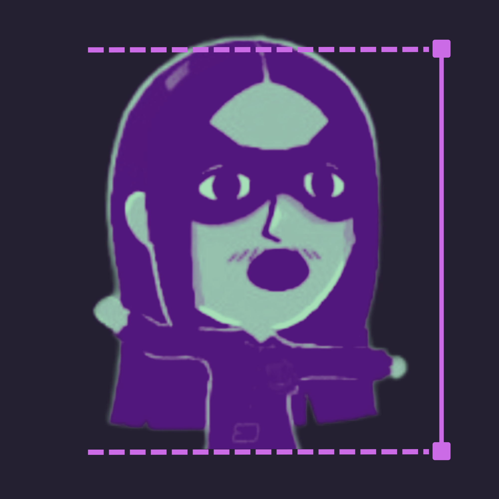
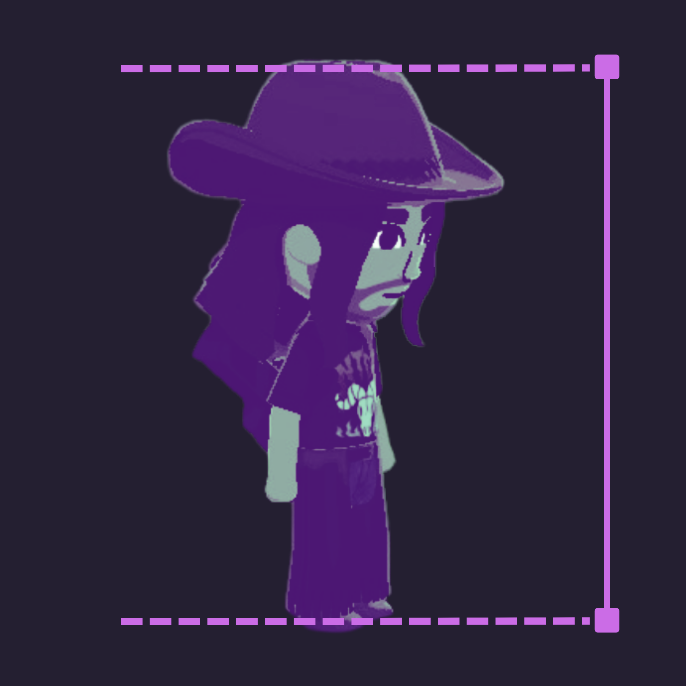
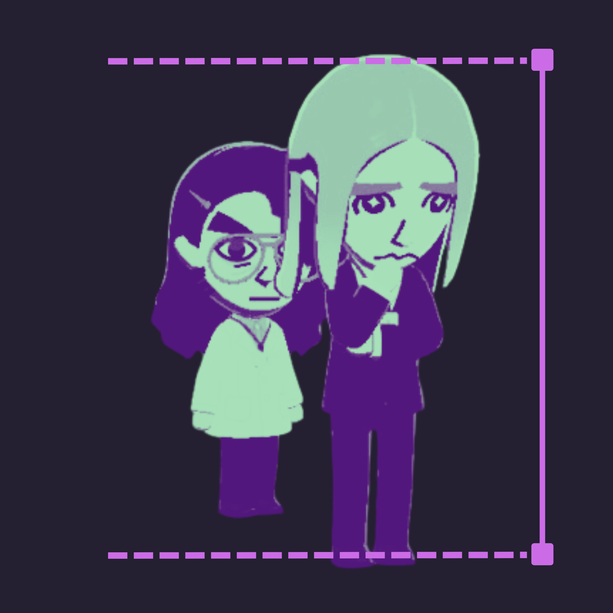
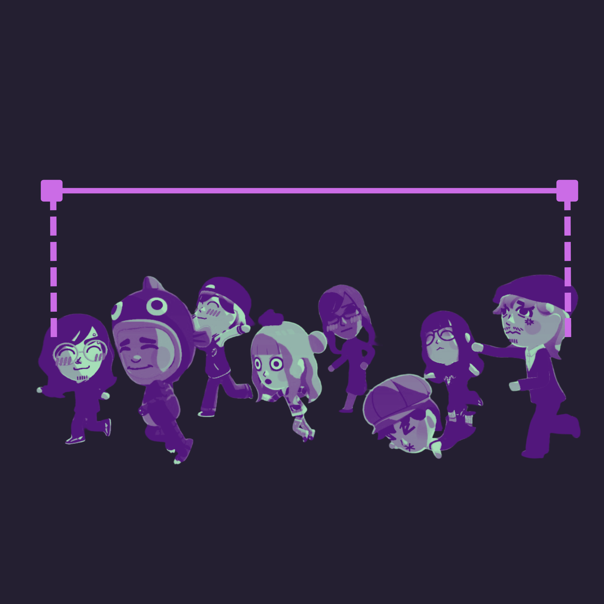
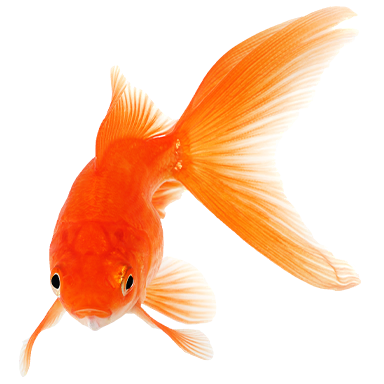

#### hi, thank you for your interest in commissioning a digital piece of artwork from me!
#### on this page you will find:
- information about pricing
- how to place an order and what i need from you
- payment methods
- and anything else related to the process/transaction

##### thank you again!

### pricing
              

### for pricing on pieces, click on the size/type you'd like to see
bust 
half 
full 
extra character 
group
  

###### click on the fish to go back

