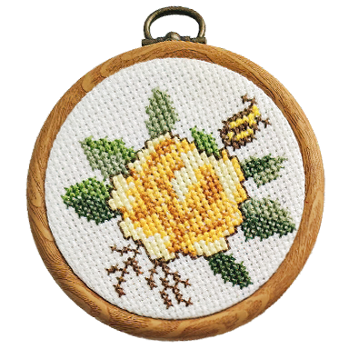
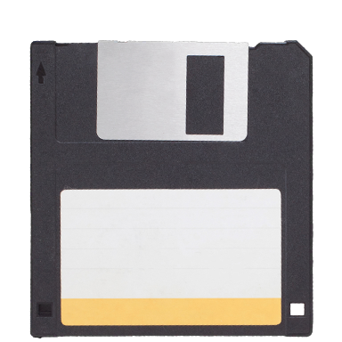

#### bust-sized prices are as follows:
- $40 for a black and white piece
  ###### like this!

  

- $45 for a flat color
  ###### like this!

  

  
- $55 for a basic, monochrome cell shaded render
  ###### like this!

  

  
- $65 for a more detailed render with more than two tones
  ###### like this!

  

###### click on the cross stitch to go back, and the floppydisk to go home
 
